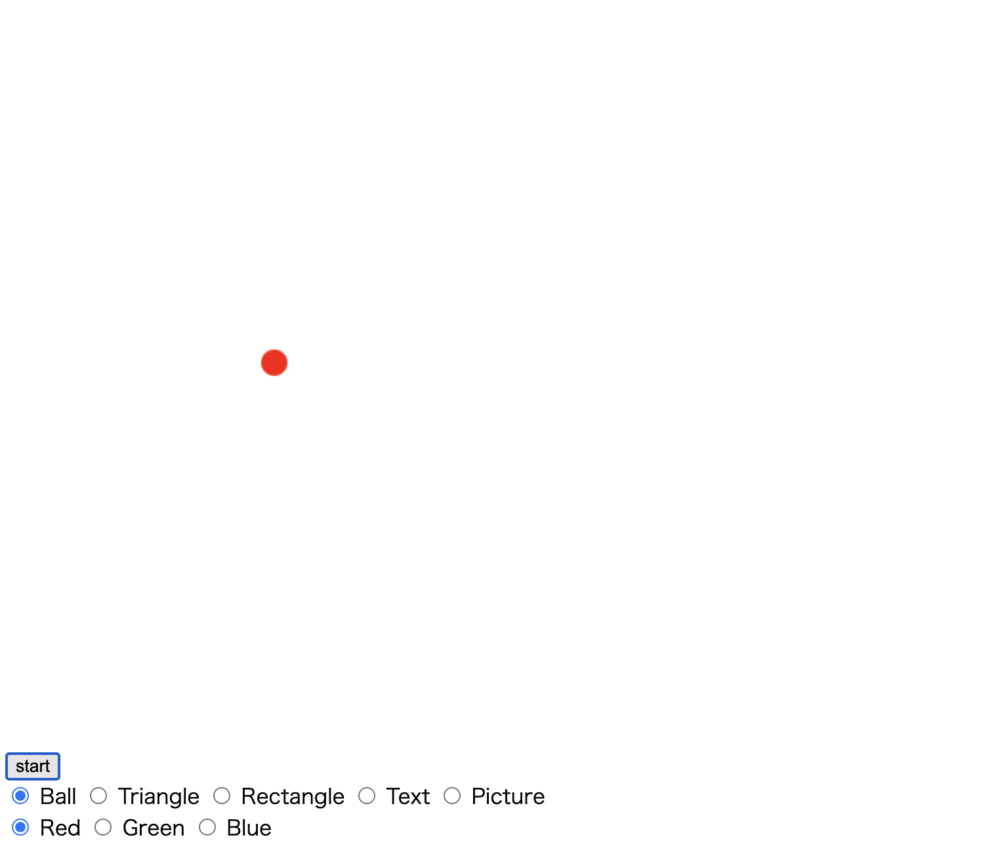
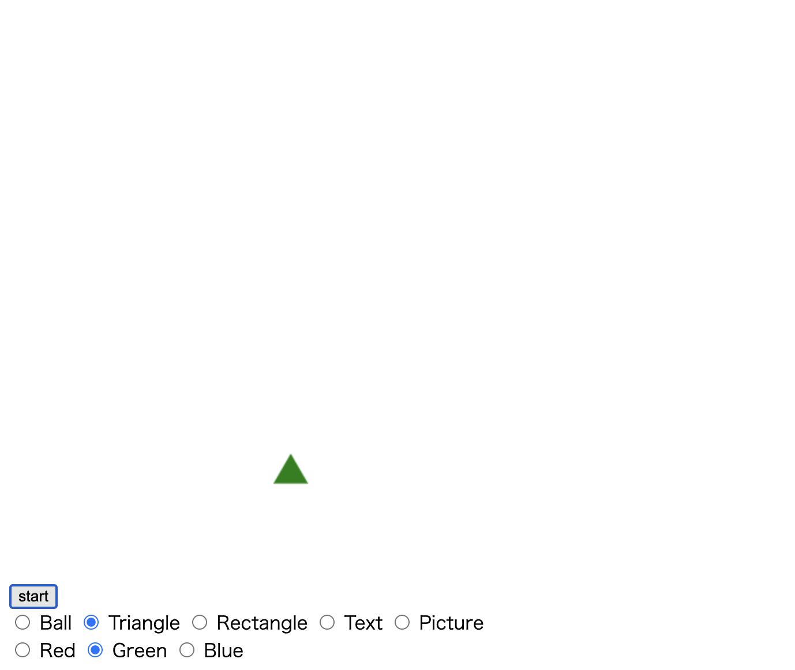
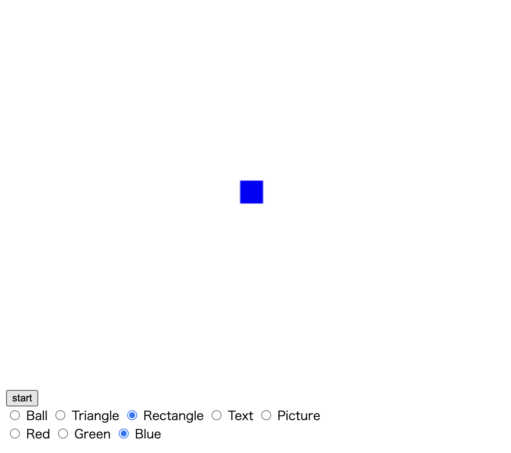
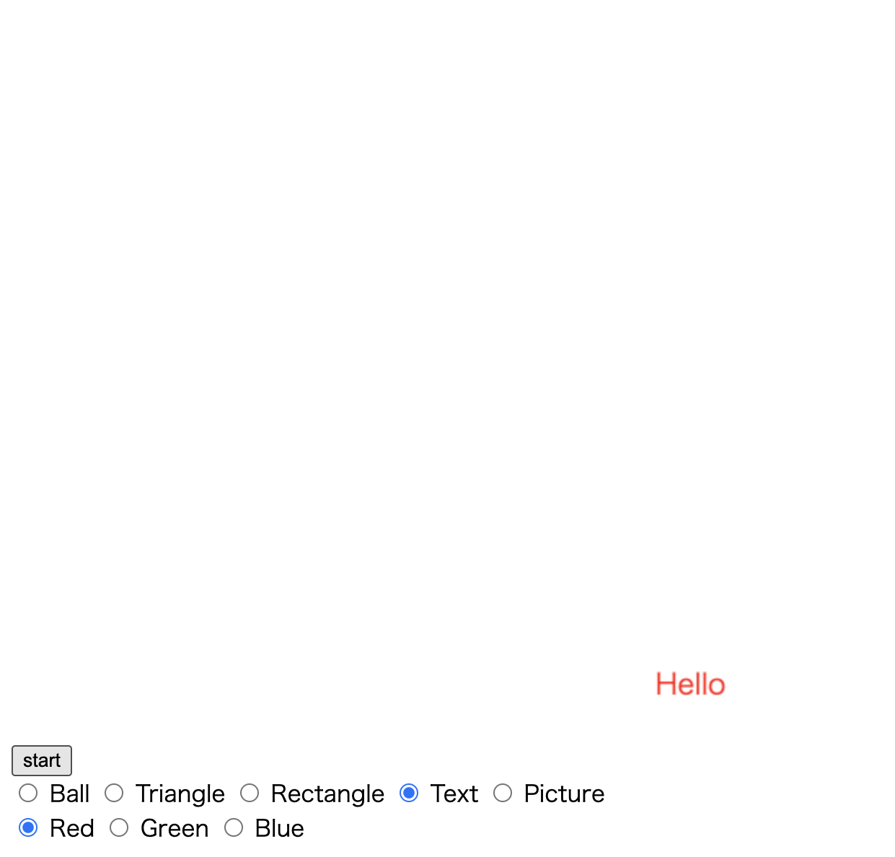
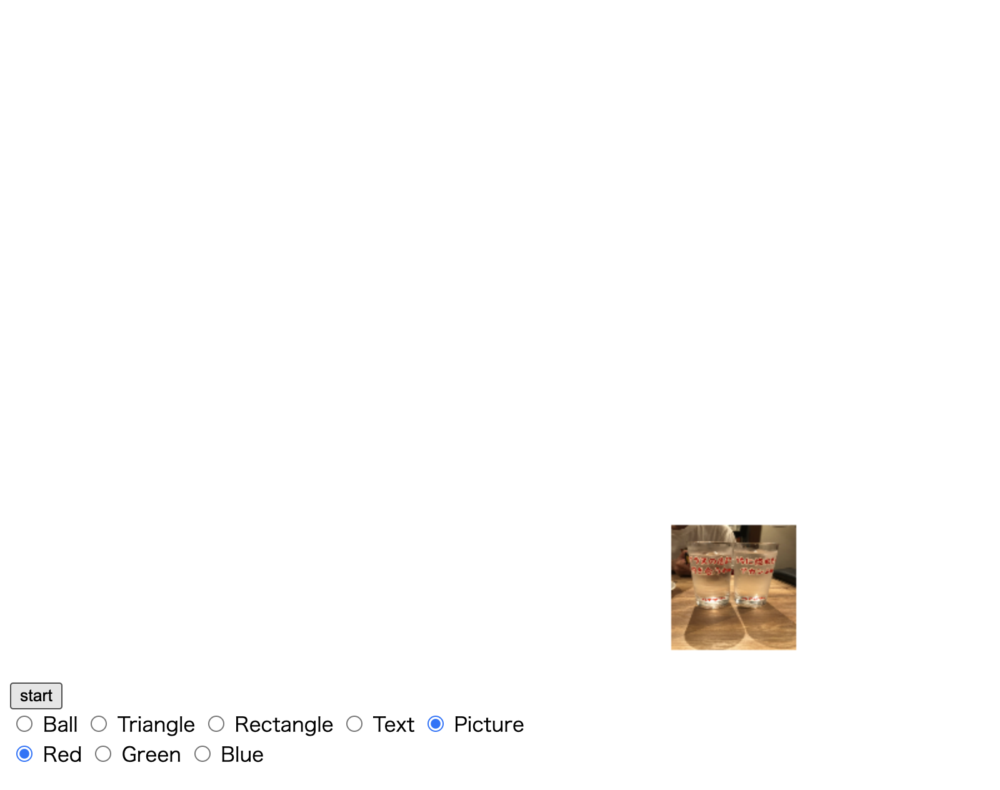

# This is [Bouncing Animation !!](https://amoyr.github.io/bouncingBall/)

# Background
I saw an animation written by programing. Then I felt so cool ! And I was amazed when I knew programing can make animation. So I try !

# How To Play
Animation target is 4 types. Those are Ball⚽️, Triangle🔺, Rectangle🟦, Text "Hello", Picture🖼. You can change the target color:Red🟥, Green🟩, Blue🟦(except Picture).

# Screenshot
Following pictures are some of this animation.

